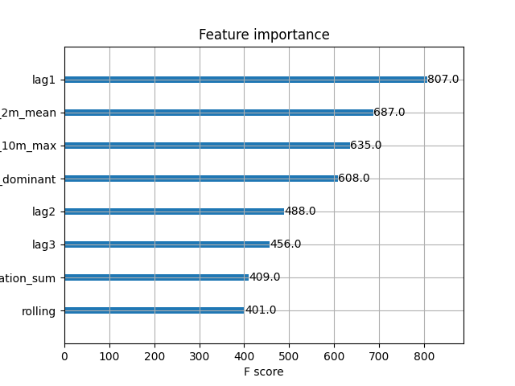
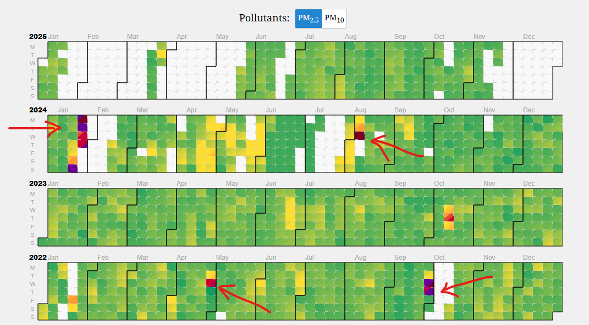
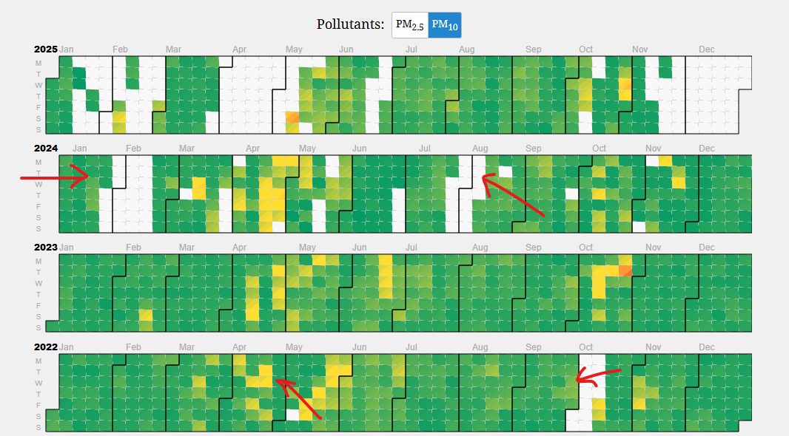
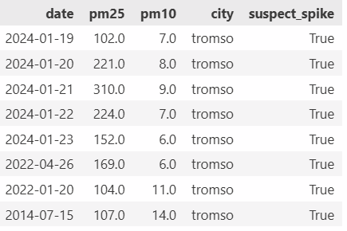

[Dashboard for Air Quality Predictions](https://joarp.github.io/mlfs-book/air-quality/)

# Project description
This repository contains the full code and infrastructure required to run a scheduled machine learning pipeline that forecasts air quality and renders a comparative dashboard.
The purpose of this project is to provide daily air quality predictions (specifically for $\text{PM}_{2.5}$) for multiple target cities and to serve these results in a dynamic dashboard. A key feature of the dashboard is the side-by-side comparison of our improved machine learning model against a standard default model for a single city, demonstrating the value of advanced feature engineering.

## Hopsworks
We use hopsworks as our feature store and for model storing.

## Daily run workflow

The pipeline is managed through a central automation file, air-quality-daily.yml.

Trigger: The workflow runs on a daily schedule.

Action: It fetches the latest data and executes the inference process (aq-inference) for all monitored cities/sensors.

Parameterization: To keep runs clean, the city is used as the unique identifier. Instead of passing many parameters, station metadata (URL, longitude, latitude) is loaded from a specific CSV file to simplify the pipeline execution.

Prerequisites for Daily Inference
For the air-quality-daily.yml workflow to succeed, a Feature Group and a Trained Model must already exist for each city/sensor in Hopsworks.

Setup: Run the feature pipeline and training pipeline when adding a new sensor or retraining the model on new data.
## Improved model
We have improved the model by adding the following features: lag1, lag2, lag3, and rolling mean of the lagged values. This gives a better prediction since PM2.5 today is highly correlated with PM2.5 yesterday. Pollution accumulates over time and PM2.5 does not suddenly disappear.

## How predictions work

## Problems with predicting the next day
Feature importance for the model trained on Tromso.

A high-quality forecast for the coming day hinges critically on having an accurate $\text{PM}_{2.5}$ measurement from the current day.

Feature Importance: As seen in the feature importance (e.g., for the model trained on Tromsø), the PM2.5 measurement from the previous day lag1 is the single most dominant predictor, followed by lagged values and weather features.
The Latency Problem: If the daily prediction workflow (air-quality-daily.yml) runs too early (e.g., in the morning), the PM2.5 value fetched from the API for the current day will be an incomplete and often significantly underestimated daily average. Pollution events, such as traffic-related spikes during evening commutes, are missed.

Mitigation Strategy: To ensure the most reliable forecast for tomorrow, the daily workflow should be scheduled to run late in the day (e.g., after the evening rush hour). If a prediction is required earlier, the model is designed to use the last complete prediction (which spans multiple days) until the late-day run completes.

## Autoregressive model for predictions > 1 day
For generating air quality predictions that extend more than one day into the future, we utilize a recursive autoregressive framework:

Mechanism: The model's prediction for day $t$ is used as an input feature (the $\text{lag}1$ value) to generate the prediction for day $t+1$, which then predicts day $t+2$, and so on.

Stability of XGBoost: Unlike linear time-series models (e.g., ARIMA) or certain neural networks that can experience explosive, unrealistic extrapolation when coefficients push values higher indefinitely, our XGBoost model remains stable:

Rule-Based: XGBoost learns a series of rules from the finite training data and cannot invent rules that push values infinitely high.

Weather Constraint: The inclusion of daily weather features also acts as a critical constraint, pushing the forecast toward plausible ranges based on external environmental factors.

## Preprocessing to remove measurements due to sensor fault
For all sensors except one, the measurements where relatively clean, but, for Tromso we identified suspect outliers abnormal for the scandinavian region. The image below show the suspect outlier:

To ensure model training and inference are based on reliable data, a specific cleaning step is implemented to remove suspect sensor fault measurements, documented in the preprocess_historical_data.ipynb notebook.

To understand if the measurements were a consequence of a faulting sensor or actual abnormal air quality e.g. due to a wildfire, we used a filter to identify and remove outliers which likely had been caused by a faulting sensor. For the Tromso station we had access to PM10 measurments and could compare if abnormalities also were found in the PM10 measurements, if not, the outliers were most probably due to a faulting sensor. Here we can see the corresponding PM10 measurements for the same outlier periods. This technique is of course not guaranteed to work but provide some idea if the outlier should be remove without manually investigating every outlier.

When measuring a PM2.5 value larger than 100 while not measuring any deviation from the median of the corresponding PM10 value for that date, it is highly likely not an observation of the actual PM2.5 value. Using a filter similar to above description we identify the following suspects for Tromso and also remove these before running the ML pipeline. This preprocessing step is done in the notebook preprocess_historical_data.ipynb

# mlfs-book
O'Reilly book - Building Machine Learning Systems with a feature store: batch, real-time, and LLMs

## ML System Examples

[Dashboards for Example ML Systems](https://featurestorebook.github.io/mlfs-book/)

# Run Air Quality Tutorial

See [tutorial instructions here](https://docs.google.com/document/d/1YXfM1_rpo1-jM-lYyb1HpbV9EJPN6i1u6h2rhdPduNE/edit?usp=sharing)
    # Create a conda or virtual environment for your project
    conda create -n book 
    conda activate book

    # Install 'uv' and 'invoke'
    pip install invoke dotenv

    # 'invoke install' installs python dependencies using uv and requirements.txt
    invoke install

## PyInvoke

    invoke aq-backfill
    invoke aq-features
    invoke aq-train
    invoke aq-inference
    invoke aq-clean

## Feldera

pip install feldera ipython-secrets
sudo apt-get install python3-secretstorage
sudo apt-get install gnome-keyring 

mkdir -p /tmp/c.app.hopsworks.ai
ln -s  /tmp/c.app.hopsworks.ai ~/hopsworks
docker run -p 8080:8080 \
  -v ~/hopsworks:/tmp/c.app.hopsworks.ai \
  --tty --rm -it ghcr.io/feldera/pipeline-manager:latest

