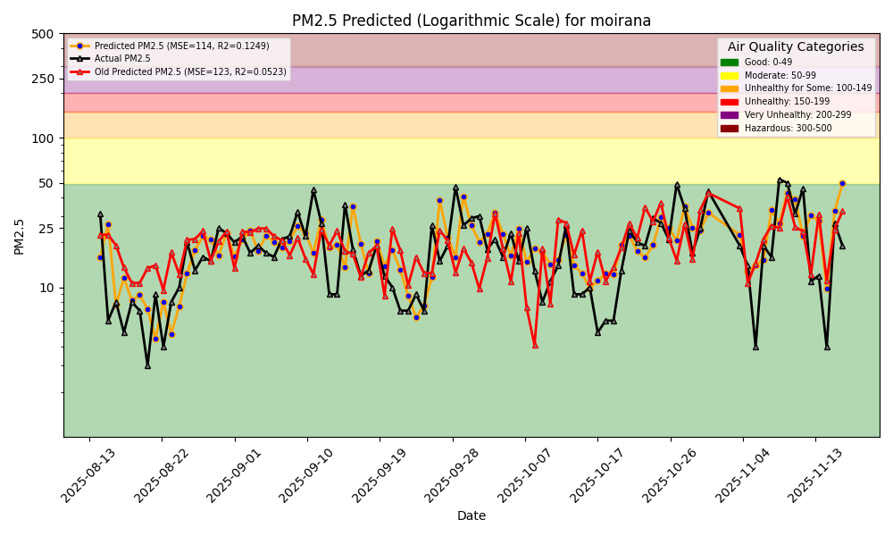
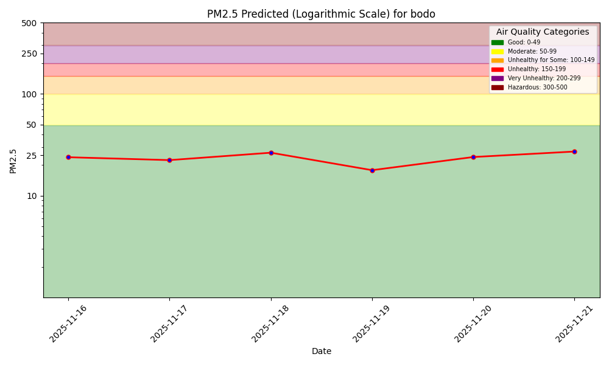
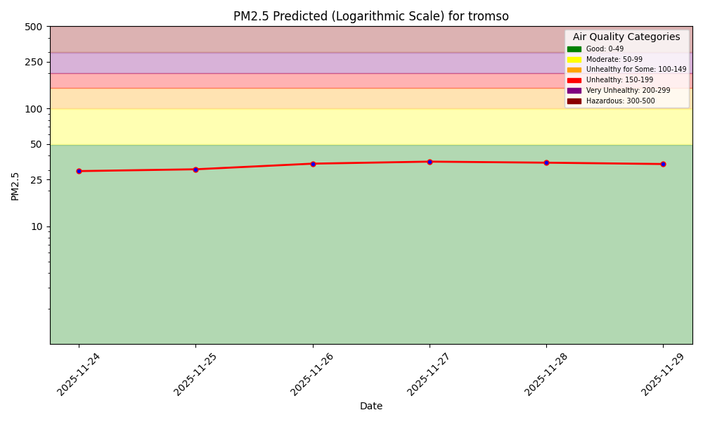
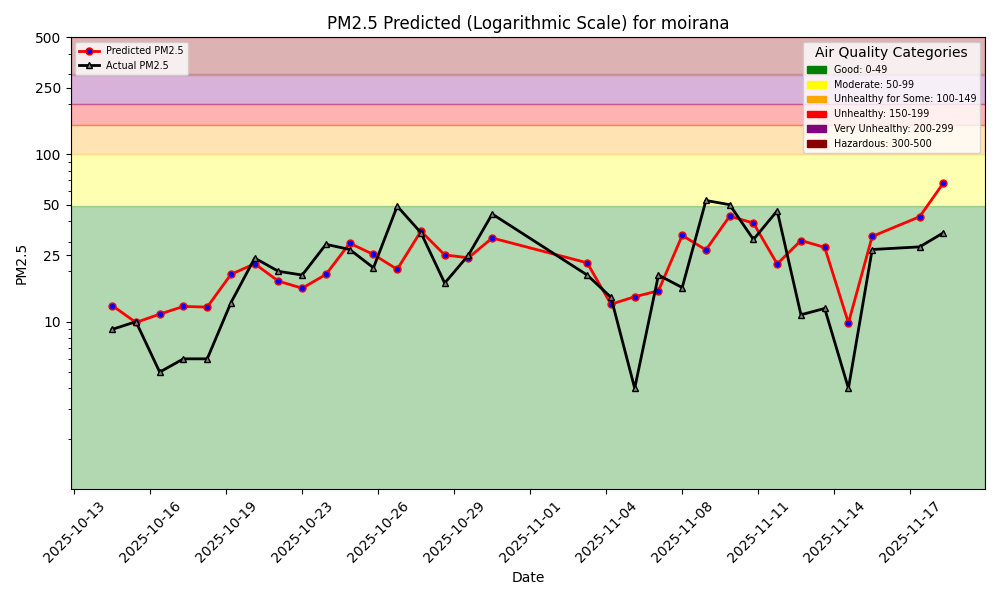
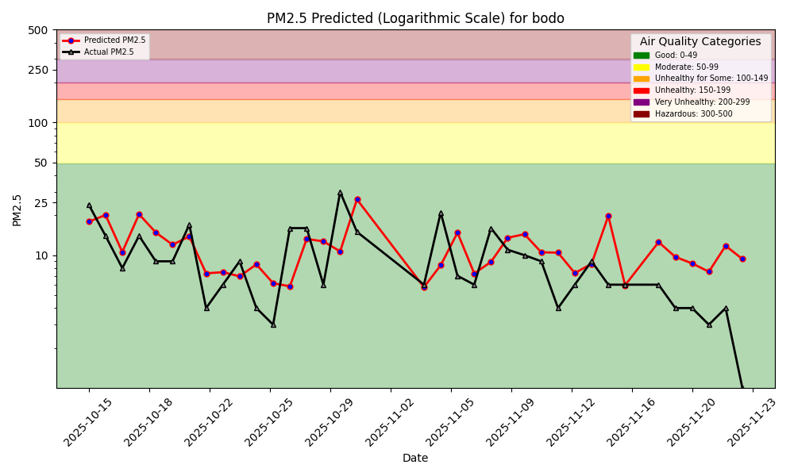
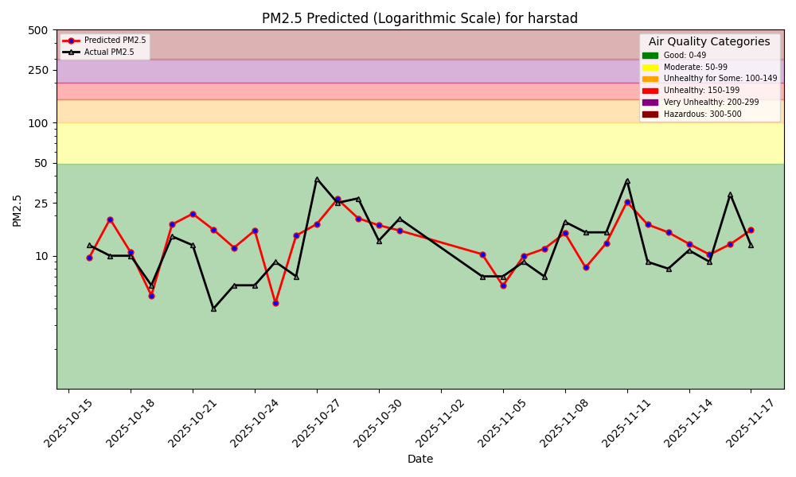
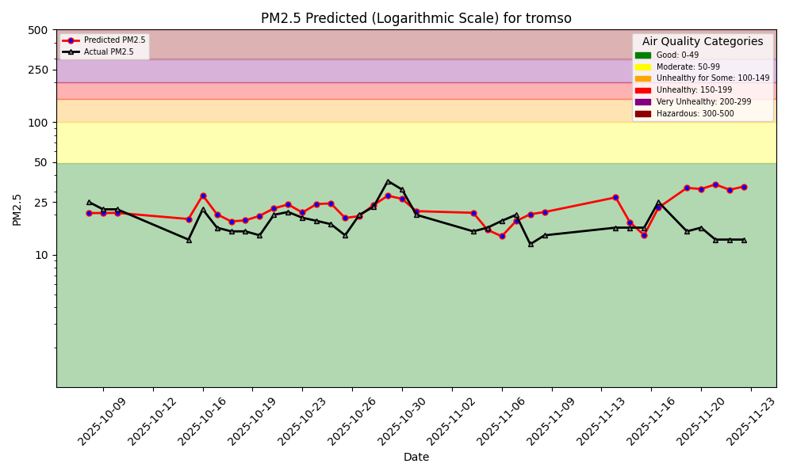

# Air Quality Dashboard

## Comparison of old and new model
The old model uses default features while the new model uses the default features and lag1, lag2, lag3, and rolling average of the lagged values. The new model is used for all predictions below

# Predictions


## Norrland county
Predictions for sensors in Norrland county will be added here as soon as historical daily average measurements of PM2.5 are available. In the meantime, have a look at predictions for Nordland and Troms county in Norway where all sensors with available historical daily average measurements in the two regions have been added.

## Nordland county (Norway)

## Troms county (Norway)

# Model Performance Monitoring

1-Day Hindcast: Predictions vs Outcomes

